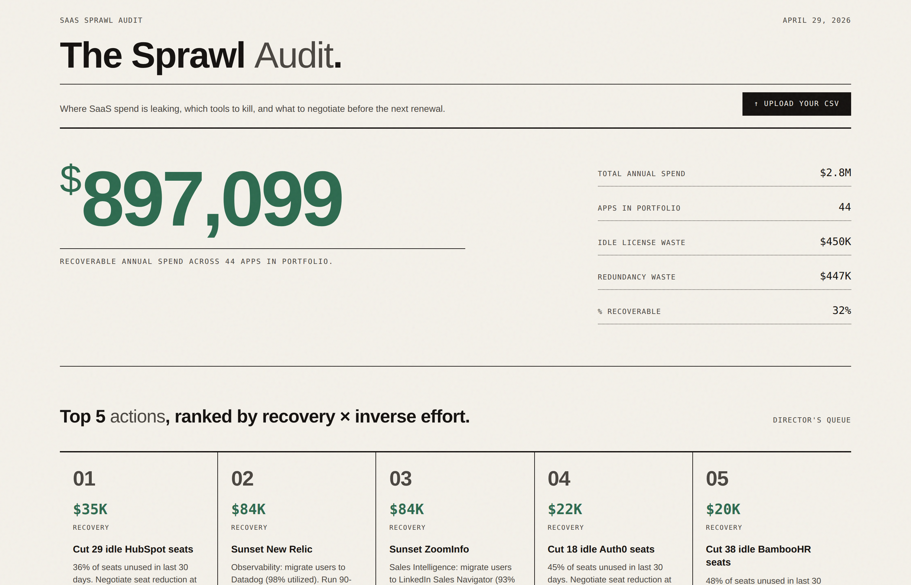
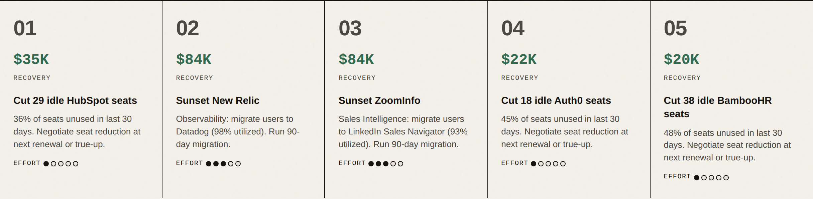
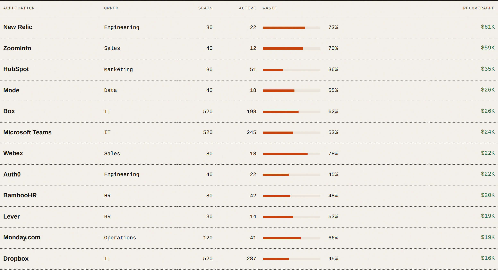
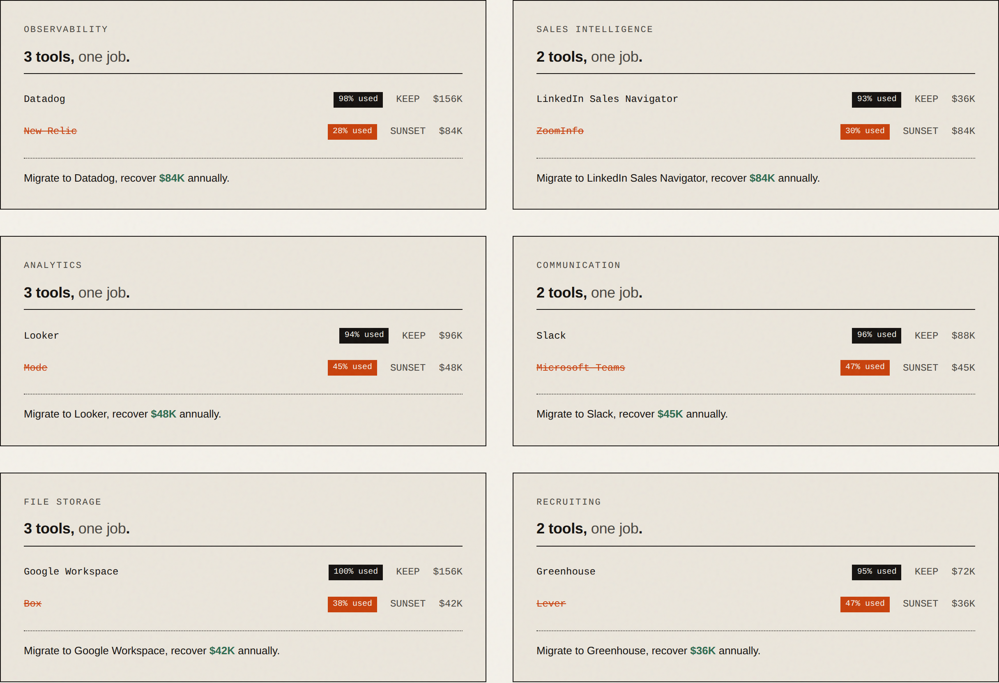
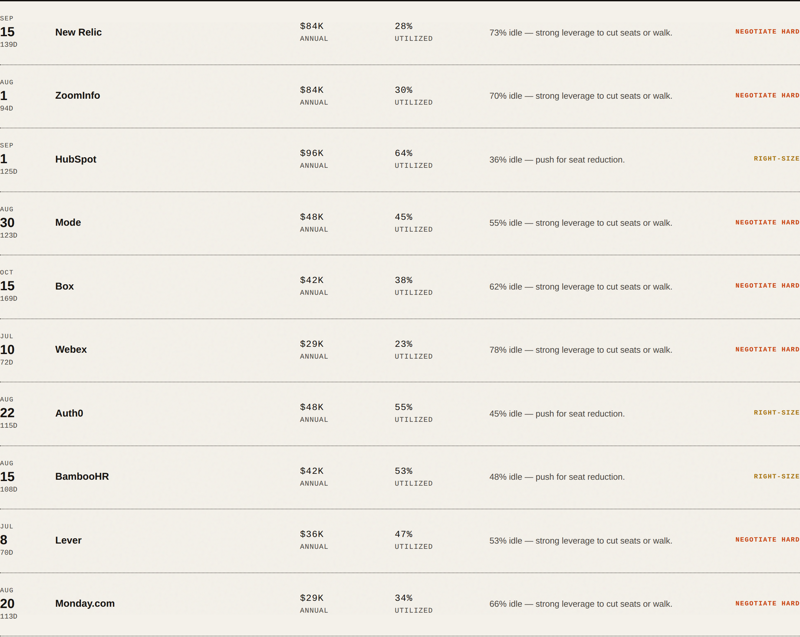

# SaaS Sprawl Audit

A single-file dashboard that takes a SaaS inventory CSV and surfaces where IT spend is leaking, which tools to consolidate, and which renewals to negotiate hard. Built for IT Directors/Managers who don't have a discovery problem — they have a *which-five-things-to-cut-this-quarter* problem.

**[Live demo →](https://shaydavisdd.github.io/saas-sprawl-audit/)** &nbsp;·&nbsp; **[Screenshots](#screenshots)** &nbsp;·&nbsp; **[Methodology](METHODOLOGY.md)**



---

## The problem

Industry research consistently shows organizations overspend 25–30% annually on unused or underutilized SaaS. Almost half of all SaaS licenses paid for in 2025 were never used — over $20 billion in waste across the industry. Nine new apps enter the average company every month.

The mid-market IT Director sees this directly. Renewal emails pile up. Finance flags duplicate line items. Department heads request "just one more" tool every sprint. The *discovery* part isn't usually the bottleneck — most Directors can name their problem apps. The bottleneck is **knowing which five fights to pick this quarter, with defensible numbers attached**.

Existing platforms (Zylo, Productiv, BetterCloud, Torii) solve this at the enterprise tier. They're priced and scoped for orgs with dedicated SaaSOps roles. For everyone else, this is still a spreadsheet problem.

This tool is the spreadsheet, made sharp.

## What it does

Drag a CSV onto the page. The dashboard renders four sections:

1. **Top 5 actions, ranked by recovery × inverse effort.** A Director's queue. The single most opinionated piece of the tool.
2. **Idle licenses.** Apps where ≥30% of seats went unused in the last 30 days, ranked by recoverable dollars.
3. **Tooling redundancy.** Apps grouped by category. Where multiple tools serve the same job, the highest-utilized wins; the rest are flagged for sunset with migration savings calculated.
4. **Renewal queue.** Upcoming renewals in the next 180 days, sorted by negotiating leverage (waste %), with a recommended posture for each.

The headline number — recoverable annual spend — is the sum of idle-license waste plus consolidation savings.

## What it deliberately does NOT do

This is the part most reviewers should care about. Scope discipline is the most expensive skill in IT leadership.

**Shadow IT discovery.** This tool analyzes the SaaS portfolio you already know about — apps with contracts, owners, and license counts. It does not crawl SSO logs, OAuth grants, or expense reports to find unsanctioned apps. That's a different problem (security posture, not spend optimization), a different buyer (CISO, not CFO), and a different product category. Tools like Nudge Security, Push Security, and BetterCloud solve shadow IT discovery well. Pairing one of them with this audit closes the loop. Building both into one tool would compete for the reviewer's attention and weaken both stories.

**Automated remediation.** No "block this app via Google Admin" buttons. No auto-revoking OAuth grants. No vendor outreach automation. These actions belong in a SaaS management platform, not an audit tool. An audit's job is to make the *next move* obvious to a human, not to take the move automatically.

**License utilization beyond seats.** Some apps charge by API calls, storage, transaction volume, or active monthly users on shared seats. The current model assumes seat-based licensing because that covers the majority of the mid-market SaaS stack. Consumption-based pricing would need its own analysis layer.

**Identity and access governance.** Who has access to what, OAuth chain mapping, orphaned accounts from incomplete offboarding — all real problems, all out of scope here.

**Negotiated discount modeling.** The tool calculates recovery as if you cut idle seats at full per-seat list price. Real renewals usually involve volume discounts, multi-year commits, and trade-offs the model doesn't see. Treat the numbers as ceiling estimates for prioritization, not as bid sheets.

## Why these scope choices

A Director-tier tool answers one question well rather than five questions vaguely. The question this answers is: **"Where can I recover budget this fiscal year, ranked by effort?"**

That question has a clear buyer (the IT Director, with a CFO backstop), a clear input (a SaaS inventory CSV most orgs already maintain in some form), and a clear output (a prioritized list with dollar values). Adding shadow IT, IGA, or consumption-pricing modeling would each pull the tool toward a different buyer with a different question. The result would be a worse tool for everyone.

## Design choices worth flagging

A few decisions that drove the build:

**CSV schema auto-detection over a fixed format.** Real SaaS inventory data lives in dozens of slightly different shapes — Zylo exports, Productiv exports, finance team spreadsheets, IT-built Google Sheets. The tool maps a wide alias list (`Application` / `App` / `Tool` / `Vendor` all become `app_name`; `Annual Cost` / `Spend` / `Yearly Cost` all become `annual_cost`) so users don't have to reformat their data. The automation that matters is the kind users never notice.

**Realistic recovery numbers, not strawmen.** The bundled sample dataset is calibrated to 32% recoverable spend — at the upper edge of industry benchmarks but not absurd. A 50%+ figure would have looked like cherry-picked demo data and undermined the tool's credibility on real inputs.

**Ranking by effort, not just dollars.** The Director's queue scores actions by `recovery ÷ effort`, not raw recovery. A $200K consolidation that requires a 90-day migration across three departments is often a worse use of political capital than three smaller seat reductions that close in two weeks. The ranking surfaces this trade-off explicitly.

**Sunset moves dominate right-size moves on the same app.** When an app shows up as both an idle-license candidate (right-size) and a redundancy candidate (sunset), only the sunset action appears in the priority queue. Right-sizing a tool you're about to kill is a waste of negotiating effort.

**Editorial layout over dashboard chrome.** No KPI cards with chart icons. No purple gradients. The dashboard is laid out like a printed audit report because that matches the artifact a Director actually wants to forward to the CFO.

See [METHODOLOGY.md](METHODOLOGY.md) for the threshold logic, scoring formulas, and what the tool intentionally treats as out of scope.

## Running it

No build step, no install. The dashboard is a single HTML file with the sample data embedded.

```bash
git clone https://github.com/[your-username]/saas-sprawl-audit
cd saas-sprawl-audit
open index.html        # or just double-click
```

To use your own data: open the dashboard, click **Upload your CSV** in the top right. Required columns (any of these aliases will be auto-detected):

| Required field | Accepted column names |
|---|---|
| App name | `app_name`, `application`, `tool`, `vendor`, `product`, `software`, `name` |
| Category | `category`, `type`, `class`, `segment` |
| Annual cost | `annual_cost`, `annual_spend`, `cost`, `spend`, `yearly_cost` |
| Seats purchased | `seats_purchased`, `licenses`, `seats`, `total_licenses`, `licensed_users` |
| Active seats (30d) | `seats_active_30d`, `active_seats`, `active_users`, `mau` |
| Renewal date | `renewal_date`, `renewal`, `renews`, `expires`, `contract_end` |
| Owner | `owner`, `department`, `team`, `cost_center` |

A sample dataset (`sample-data.csv`) modeled on a 500-person tech company is included.

## Compatible data sources

The audit tool is deliberately a "last mile" product — it consumes data from whatever source the org already has. The hardest field to source is `seats_active_30d` (actual usage telemetry, not billing data). Three realistic paths cover most mid-market orgs:

**Path 1 — SaaS management platform (already-paid).** If the org runs Zylo, Productiv, BetterCloud, Torii, or Nudge Security, the audit input is already 90% of the way there. These tools all export CSVs in formats the dashboard's auto-detection handles directly. For Zylo specifically, `scripts/zylo-normalize.py` provides an explicit, version-stable bridge.

**Path 2 — Identity provider + finance export (recommended for mid-market).** This is what most orgs can deploy without buying new tooling. Pull SSO sign-in logs from the IdP, join with a finance CSV, run as a weekly cron job. Two reference implementations:
  - `scripts/okta-join.py` — Okta System Log API + finance CSV
  - `scripts/gworkspace-join.py` — Google Workspace Admin SDK + finance CSV

Each script is ~150 lines, documents its own setup, and writes audit-ready CSVs to stdout or a file. Limitations match the audit tool itself — apps not behind SSO are invisible (which is correct: shadow IT discovery is a separately scoped problem).

**Path 3 — Manual inventory (small orgs).** For orgs under ~150 employees with under ~30 SaaS apps, a Google Sheet maintained by IT and exported monthly is a defensible starting point. Active-seat data comes from each vendor's admin console. Failure mode: data goes stale fast — the dashboard becomes unreliable after 60-90 days of neglect.

See `scripts/README.md` for full documentation, authentication setup, and a comparison table to choose the right script.

## Screenshots

### Top 5 actions — the Director's queue


### Idle licenses


### Tooling redundancy


### Renewal queue


## Stack

Single-file HTML, vanilla JS, no dependencies, no build. Fonts via Google Fonts CDN. Designed to be hostable on GitHub Pages without configuration.

## License

MIT. Use it, fork it, ship a better one.
